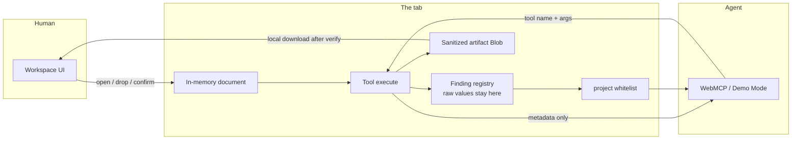
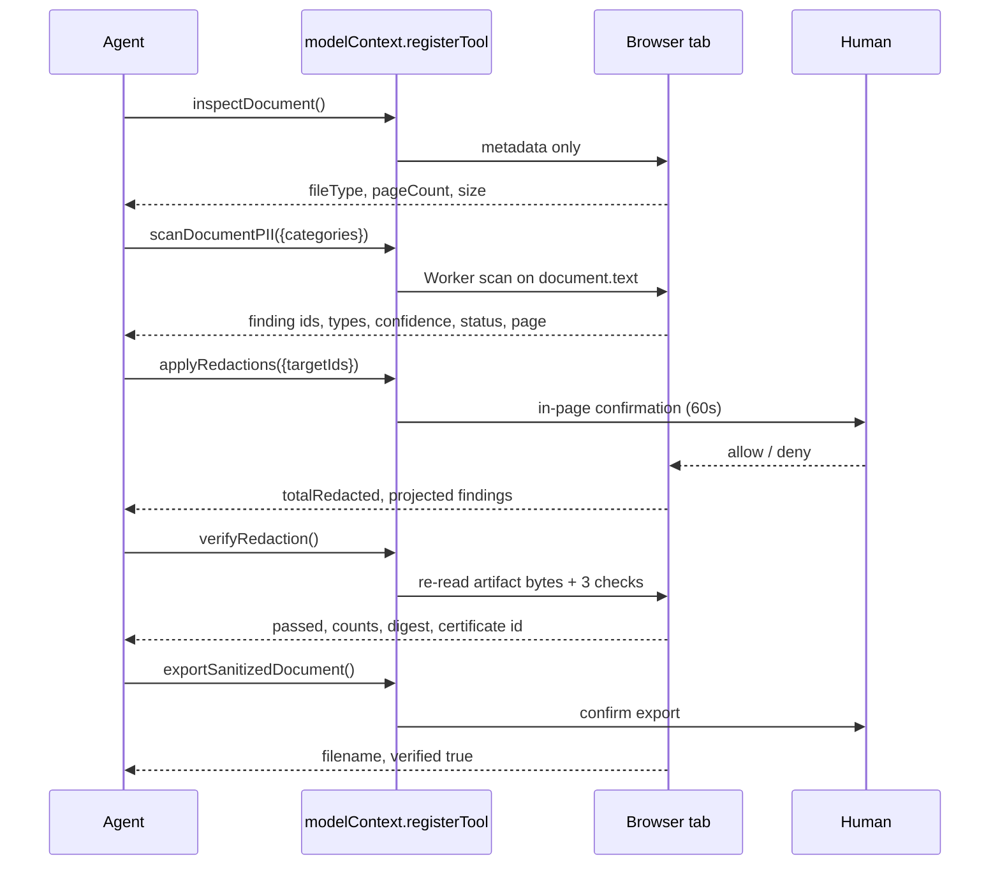
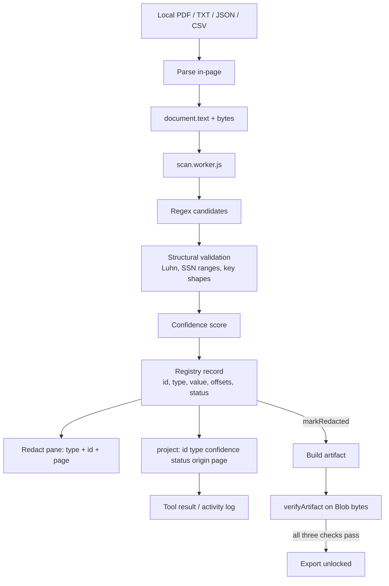
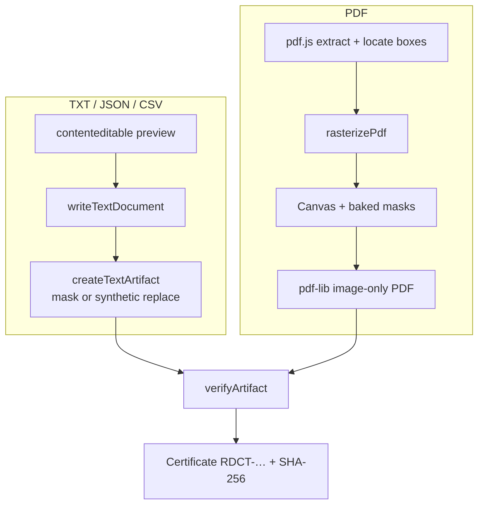

<p align="center">
  <picture>
    <source srcset="assets/logo-dark.svg" media="(prefers-color-scheme: dark)" />
    <source srcset="assets/logo.svg" media="(prefers-color-scheme: light)" />
    
  </picture>
</p>

<h1 align="center">redacta</h1>

<p align="center">
  The WebMCP-native privacy boundary for AI agents.<br />
  Built for the <a href="https://webmcp.devpost.com/">WebMCP Challenge</a>.
</p>

<p align="center">
  <a href="https://redacta-theta.vercel.app/">Live app</a> ·
  <a href="https://redacta-theta.vercel.app/app.html">Workspace</a> ·
  <a href="https://redacta-theta.vercel.app/app.html?demo=agent">Agent demo</a> ·
  <a href="https://redacta-theta.vercel.app/ai.html">Machine-readable page</a> ·
  <a href="https://redacta-theta.vercel.app/tools.html">WebMCP tools</a> ·
  <a href="https://github.com/Manoj-otelai/Redacta">Source</a>
</p>

<p align="center">
  
</p>

**Live:** [https://redacta-theta.vercel.app/](https://redacta-theta.vercel.app/)

Redacta lets an AI agent inspect, scan, redact, verify, and export a confidential PDF, TXT, JSON, or CSV **without ever receiving the document contents or the sensitive values**. Parsing, detection, masking, verification, and export all run inside the tab. There is no application backend and no upload endpoint.

The product in one line: the agent can know there are seven SSNs. It never knows what those SSNs are.

- [For judges](#for-judges)
- [Why this is a WebMCP use case](#why-this-is-a-webmcp-use-case)
- [How it actually works](#how-it-actually-works)
- [System diagrams](#system-diagrams)
- [Privacy projection](#privacy-projection)
- [The ten WebMCP tools](#the-ten-webmcp-tools)
- [Detection pipeline](#detection-pipeline)
- [Verification](#verification-why-export-is-locked)
- [How we built it](#how-we-built-it)
- [Repository map](#repository-map)
- [Run locally](#run-locally)
- [Test and vendor](#test-and-vendor)
- [License](#license)

---

## For judges

Open the live app in **ChatGPT’s in-app browser** (WebMCP on by default) or **Chrome 149+** with `chrome://flags/#enable-webmcp-testing` enabled, then restart Chrome.

| What | URL |
| --- | --- |
| Landing | [https://redacta-theta.vercel.app/](https://redacta-theta.vercel.app/) |
| Workspace | [https://redacta-theta.vercel.app/app.html](https://redacta-theta.vercel.app/app.html) |
| Agent demo (starts on load) | [https://redacta-theta.vercel.app/app.html?demo=agent](https://redacta-theta.vercel.app/app.html?demo=agent) |
| Machine-readable landing | [https://redacta-theta.vercel.app/ai.html](https://redacta-theta.vercel.app/ai.html) |
| WebMCP tools write-up | [https://redacta-theta.vercel.app/tools.html](https://redacta-theta.vercel.app/tools.html) |
| Source | [https://github.com/Manoj-otelai/Redacta](https://github.com/Manoj-otelai/Redacta) |

1. Open the [workspace](https://redacta-theta.vercel.app/app.html), or the [agent demo](https://redacta-theta.vercel.app/app.html?demo=agent) to start the full run on load.
2. Open a local PDF, TXT, JSON, or CSV — or click **Run agent demo**, which loads the synthetic contract. Nothing is uploaded.
3. With native WebMCP, the status chip reads **NATIVE WEBMCP** and ten tools are registered on `document.modelContext` or `navigator.modelContext`.
4. Without the flag, **Demo Mode** exposes the same tools on `window` and in the **Console** pane — same schemas, same privacy projection.
5. Click **Run agent demo**, or paste the prompt from the **Agent** pane into ChatGPT. Mutating calls (`applyRedactions`, `exportSanitizedDocument`, `registerCustomPattern`, `redactField`) stop for an in-page confirmation.
6. On the **Agent** pane, expand **What the agent received**. Every payload is rescanned against detected values. A leak is treated as a bug, not a demo state.
7. After a passing verify, the **Redact** pane shows **Verification passed** and the metadata-only certificate id (`Certified RDCT-…` plus a short digest). No document text.
8. Export stays blocked until verification passes all three checks.

Suggested agent prompt (also copied from the workspace):

```
Inspect this document, scan it for SSNs, credit cards, emails and API keys, redact every finding, verify the sanitized copy, then export it. If the file is JSON or CSV, list its structured fields and redact the whole records[].card key.
```

---

## Why this is a WebMCP use case

These are the four questions the challenge asks submissions to answer.

**Why WebMCP is the right surface.** Redaction is a capability, not a reading task. An agent that scrapes the DOM, or that is handed the file, has already crossed the line the user is trying to protect. WebMCP lets the page publish *operations* — scan these categories, redact these finding IDs, verify the artifact, export only if it passed — while the values stay in a private in-memory registry. The tool API *is* the privacy boundary.

**What is better for the human.** The person keeps a normal document workspace: drop a file, see findings, mark regions, approve or deny the agent. They do not paste a contract into a chat, and they do not trust a black rectangle drawn over live PDF text. The agent drives the workflow; the human stays the authority on mutate and export.

**What people and agents can do together that was hard before.** Before WebMCP, the choice was “don’t use an agent on this file” or “give the agent the file.” Redacta is a third path: the agent can run a complete inspect → scan → redact → verify → export loop, including structured-field redaction on JSON/CSV and human-approved custom detectors, and the only thing that leaves the tab is metadata (IDs, categories, confidence, page numbers, pass/fail, a SHA-256 digest).

**How WebMCP is implemented.** `src/ui.js` registers all ten tools with `document.modelContext.registerTool` or `navigator.modelContext.registerTool`:

```js
modelContext.registerTool({
  name,
  description: TOOL_DESCRIPTIONS[name],
  inputSchema: TOOL_SCHEMAS[name],
  execute: (input) => execute(name, input),
});
```

Schemas and “never returns document contents or sensitive values” descriptions live in `src/tools.js`. Tool results are projected through a fixed whitelist in `src/registry.js` (`id`, `type`, `confidence`, `status`, `origin`, `page`). Agent-initiated mutations call `requestConfirmation` before they change anything. If `modelContext` is missing, Demo Mode puts the same functions on `window` so the Console pane and the in-page agent demo still exercise the real tools.

---

## How it actually works

A file never becomes a chat attachment. It is opened in the page (`File` / drop / agent demo), parsed in-memory, and held as a document object (`kind`, `bytes`, `text`, PDF page handles, optional notes). From that moment the agent only talks to named tools.

1. **`inspectDocument`** returns filename, type, size, page count. No text.
2. **`scanDocumentPII`** runs detectors in a Web Worker on `document.text`. Hits are stored in a private finding registry. The tool result is the projected rows only.
3. **`applyRedactions`** (human approval if the caller is an agent) marks findings `redacted` and builds a sanitized artifact Blob.
4. **`verifyRedaction`** re-reads that Blob — not the UI state — and reports three independent checks plus a SHA-256 digest.
5. **`exportSanitizedDocument`** (human approval, blocked until verify passed) triggers a local download. The tool result is filename + `verified: true`.

JSON/CSV add `listStructuredFields` and `redactField` so an agent can say “redact every `records[].card`” without seeing a card number. Custom detectors go through `registerCustomPattern` (also human-approved, max 5, unsafe patterns rejected).

The human can do the same loop from the **Redact** pane, mark extra regions by hand, undo a batch, and edit text (or type PDF notes). Edits remap finding offsets and drop values that no longer exist. Refresh in the same tab restores the workspace; closing the tab does not leave the original document as a durable save.

---

## System diagrams

### The privacy boundary

The agent never receives the file, the extracted text, or the matched values. It receives operations and metadata.



### Agent loop



### What happens to one finding



### PDF vs text path



---

## Privacy projection

The registry stores the raw finding (`value`, offsets, geometry). Tools, activity log, and errors only see a whitelist.

| The agent receives | The agent never receives |
| --- | --- |
| Finding IDs and counts | Document text |
| Categories (`ssn`, `credit_card`, …) | Matched values and secrets |
| Confidence and status | Locations, offsets, geometry |
| Coarse page numbers | Artifact bytes |
| Pass/fail and per-category remainder counts | Raw errors that could echo a value |
| Certificate digest and numeric checks | Anything not on the safe-field whitelist |

Safe fields in `src/registry.js`: `id`, `type`, `confidence`, `status`, `origin`, `page`.

Every tool result is also rescanned against detected values before it is shown in the Agent pane. If a payload contains a raw value, that is treated as a bug, not a demo state.

Agent mutations that change the document or leave the machine (`applyRedactions`, `redactField`, `registerCustomPattern`, `exportSanitizedDocument`) call `requestConfirmation`. The human has 60 seconds to allow or deny.

---

## The ten WebMCP tools

Registered on `document.modelContext` or `navigator.modelContext` when native WebMCP is available; Demo Mode otherwise. Every description states that contents and sensitive values are never returned.

| Tool | What it does | What it returns |
| --- | --- | --- |
| `inspectDocument({})` | Local metadata | `fileType`, `filename`, `documentSize`, `pageCount`, `processingStatus` — no text |
| `scanDocumentPII({categories?})` | Local detectors | Counts and projected findings — no values or locations |
| `getFindingDetails({findingId})` | One finding | Category, confidence, status, origin, page |
| `applyRedactions({targetIds?, maskMode?})` | Mask selected findings | `totalRedacted`, projected findings. **Human approval.** |
| `verifyRedaction({categories?})` | Rescan artifact bytes and coverage | `passed`, `extractableFindings`, `unmaskedRegions`, `originalValuesFound`, per-category counts |
| `exportSanitizedDocument({filename?})` | Download the artifact | Filename and `verified: true`. **Blocked until verify passes. Human approval.** |
| `getVerificationCertificate({})` | Metadata-only proof | Digest, issued time, check counts — no contents |
| `registerCustomPattern({name, pattern, flags?})` | Extra local detector (max 5) | Registered name and count. **Human approval.** Unsafe / empty / slow patterns are rejected first. |
| `listStructuredFields({})` | JSON keys or CSV columns | Field names, occurrence counts, detected-finding counts — no values |
| `redactField({field, maskMode?})` | Whole key or column | Counts and projected findings. **Human approval.** String JSON leaves and CSV cells only, so the artifact stays valid JSON. |

Activity log entries store summarized arguments and the same privacy-safe results the agent received.

**Categories:** `ssn`, `credit_card`, `email`, `phone`, `api_key`, `private_key`, `bearer_token`, `db_connection_string`, plus `custom:<name>` after a pattern is registered.

**Mask modes:** `blackout` or `synthetic_replacement`. Synthetic mode substitutes plausible local placeholders. Verification excludes those placeholders from “remaining findings,” counts them separately, and still fails if any original raw value survives.

---

## Detection pipeline

Detectors live in `src/detectors.js`. They are layered on purpose: a regex hit is not enough.

1. **Candidate** — category regexes (SSN, Luhn-length digits, email, US-style phone, `sk_live` / `ghp_` / `AKIA` keys, `Bearer` tokens, DB URIs, PEM private keys).
2. **Validate** — `src/validators.js` (Luhn, reserved SSN ranges, key / token / connection shapes).
3. **Score** — `src/scoring.js` confidence from candidate + validation.
4. **Locate** — text offsets for TXT/JSON/CSV; PDF box mapping via reconstructed page items in `src/pdfDocument.js`.
5. **Project** — only the safe fields leave the registry.

Custom patterns are compiled locally, capped at five, and rejected if they are empty, too broad, missing flags we do not allow, or look like they would hang the worker. The scan itself runs in `src/scan.worker.js` so a long document does not freeze the UI.

This is a local heuristic pipeline, not a claim that every secret on earth is found. The WebMCP thesis is the boundary: whatever *is* found, the agent never sees the value.

---

## Verification (why export is locked)

App state is never treated as proof. `verifyRedaction` re-reads the generated Blob (`src/verify.js`) and reports three independent checks:

| Check | What it answers |
| --- | --- |
| **`extractableFindings`** | Do detectors still fire on the artifact bytes? |
| **`unmaskedRegions`** | Are any in-scope findings still pending in the registry? |
| **`originalValuesFound`** | Do any original raw strings still appear in the artifact? |

A rasterized PDF has no text layer, so a text rescan alone would pass while a skipped bar is still visible. That is why coverage (`unmaskedRegions`) exists. Any of the three failing blocks export. Export also re-checks the SHA-256 digest so a file changed after verification cannot be downloaded as verified.

A passing run issues a certificate (`RDCT-…`) with the digest, document metadata, and numeric results — never document text or finding values. The **Redact** pane shows `Verification passed` and `Certified RDCT-… · <digest12>…`.

---

## How we built it

Redacta is a static ES-module web app. No framework, no bundler, no server that sees the file.

| Decision | Why |
| --- | --- |
| **Plain ES modules, `app.html` → `src/app.js` → `initUI()`** | Judges (and agents) can read the source as shipped. No hidden compile step. |
| **Vendored `pdfjs-dist@6.2.108` and `pdf-lib@1.17.1`** | PDF parse and export do not need a CDN for document bytes. |
| **Web Worker scan** | Detection stays off the main thread. |
| **Finding registry + whitelist** | One place stores values; one function decides what a tool may return. |
| **Rasterized PDF export** | Masks are baked into images. A black rectangle over live glyphs is not a redaction. |
| **In-page confirmation** | WebMCP can call mutate tools; the human is still the authority. |
| **Demo Mode fallback** | Same tools and schemas when `modelContext` is missing, so the Console and agent demo still prove the loop. |
| **Tab-scoped session restore** | Refresh keeps the workspace (`sessionStorage` token + IndexedDB). Close the tab and the next visit does not reload another tab’s original. |
| **`node --test`** | Projection, verification, structured fields, session restore, and remap behavior are covered without a browser harness. |

Hosting is the repository root on Vercel (`vercel.json`). Pages are static files. Document bytes and detector values are not sent to an API we own.

The workspace is a real editor, not a screenshot of one: text/JSON/CSV are `contenteditable`; PDFs get a text layer for copy and click-to-type notes that are included in scan and export.

---

## Repository map

```
app.html              Workspace (human + agent)
index.html            Landing
tools.html            How the ten tools are built
ai.html / ai-tools.html
                      Machine-readable twins
src/app.js            Entry → initUI()
src/ui.js             Registration, confirmation, panes, persist
src/tools.js          Ten tool implementations + schemas
src/registry.js       Private records + project() whitelist
src/detectors.js      Regex + synthetic placeholders
src/validators.js     Luhn, SSN, key shapes
src/scoring.js        Confidence
src/scanner.js        Worker bridge
src/scan.worker.js    Off-thread detectCandidates
src/verify.js         Byte-level rescan
src/textDocument.js   TXT / JSON / CSV load + artifact
src/pdfDocument.js    Load, locate, rasterize, extract
src/structured.js     JSON / CSV field names and ranges
src/editor.js         Remap offsets after edits
src/session.js        Same-tab restore, orphan prune
src/network.js        Outbound-request monitor
test/redacta.test.js  node --test
vendor/               pdf.js + pdf-lib (pinned)
```

---

## Run locally

No build step. Serve the repository root:

```bash
npx serve .
# or
python -m http.server 4173
```

The production app is [https://redacta-theta.vercel.app/](https://redacta-theta.vercel.app/). Local paths match that host:

| Local | Live |
| --- | --- |
| `/` | [https://redacta-theta.vercel.app/](https://redacta-theta.vercel.app/) |
| `/app.html` | [https://redacta-theta.vercel.app/app.html](https://redacta-theta.vercel.app/app.html) |
| `/app.html?demo=agent` | [https://redacta-theta.vercel.app/app.html?demo=agent](https://redacta-theta.vercel.app/app.html?demo=agent) |
| `/ai.html` | [https://redacta-theta.vercel.app/ai.html](https://redacta-theta.vercel.app/ai.html) |
| `/tools.html` | [https://redacta-theta.vercel.app/tools.html](https://redacta-theta.vercel.app/tools.html) |

Fonts and landing artwork ship in `assets/`. Vercel (`vercel.json`) and Netlify (`netlify.toml`) publish the repository root as static files.

Open a local PDF, TXT, JSON, or CSV from the empty state, or click **Run agent demo** to load the synthetic contract. On JSON or CSV, the agent demo also lists structured fields and redacts one whole field before it continues.

---

## Test and vendor

```bash
npm ci
npm run vendor
npm test
```

`vendor/` holds the exact `pdfjs-dist@6.2.108` and `pdf-lib@1.17.1` browser artifacts. Runtime document handling does not fetch those engines from a third-party host.

---

## License

[ISC](./LICENSE). Copyright © 2026 Manoj Kumar.
